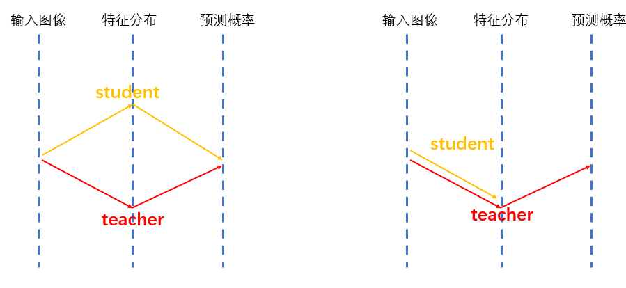

# LandMark_distill--景物识别_蒸馏

# _简介_
本代码用于对景物识别项目的轻量化知识蒸馏。
最终commit版本采用的技术方案如下：

1、学生模型结构为Resnet12或Swin-tiny，两种模型都加宽了通道数以匹配1024维输出特征。

2、蒸馏损失为基于分类概率预测的KL散度损失。

3、学生模型的分类层直接加载教师模型对应权重，并在训练过程中保持固定。

4、蒸馏训练中只调整学生模型特征提取网络部分。

（如下图右半所示，通过使用同一个分类层，强制让学生模型在特征分布的层面去接近教师。）

 

蒸馏实验效果如下表所示：

|网络模型  |参数量（不含 25w分类层）|训练轮数 epoch/warmup |最终测试精度 （特征匹配所得） | 备注 |
|:--:     |:--:              |:--:        |:--:    | :--: |
|Swin-base|8.7*10^7   |--|coarsegrained:[0.91765] finegrained:[0.92292]|教师模型自身-对照|
|Resnet12 |3.2*10^7  |40/0    |coarsegrained:[0.88198] finegrained:[0.88872]  |（加粗的）Resnet12在测试集上匹配精度比教师网络略低2~3个百分点，参数量压缩为约1/3;|
|Swin-tiny|4.8*10^7  |200/10 |coarsegrained:[0.92028] finegrained:[0.93023]|（加粗的）Swin-tiny在测试集上匹配精度与教师网络基本持平，参数量压缩为约1/2。|

 

# _代码结构_

代码包中主要文件及其作用：

    LandMark_distill/
        main.py                 主函数文件
        trainer.py              训练、验证、测试具体流程实现
        helpers.py              准备数据集，准备模型实例，准备优化器
        model.py                整体模型定义，内部包括学生模型和教师模型，以及训练/测试阶段各自的前向推理
        resnet12.py             Resnet12网络结构
        swin_transformer.py     Swin网络结构
        utils.py                集成运行目录生成、训练精度统计、特征匹配测试等零散方法
        start.sh                程序入口脚本
        simple_config.json      提交taiji平台运行的配置文件

 

# _使用说明_

程序入口为start.sh脚本文件，运行Resnet12和Swin-tiny所用的超参数已分别填写在文件中。

直接执行 $ sh start.sh 命令即可在本地启动蒸馏训练。

或通过 $ jizhi_client start -scfg simple_config.json 提交taiji平台运行。

（蒸馏训练的时间成本及显存占用较高，建议使用8卡运行。）

 

程序的输出路径由超参数“--save_dir”指定，也可直接到utils.py中修改默认值。

任务启动后，会根据当前超参数配置在输出路径下生成任务目录。

蒸馏训练执行完毕后，任务目录中包含如下内容（示例）：

    save_dir（输出路径）
    |
    |---TLD-Swin_tiny-KD-1.0（一级任务目录）
        |
        |---lr0.001_AdamW_cosine_epoch200_warmup10_bs256-head_fixed（二级任务目录）
            |
            |---record.txt（运行日志）
            |
            |---max_acc.pth（训练中保存的最优权重）
            |
            |---checkpoint.pth.tar（运行状态信息，用于可能的中断重启）
            |
            |---opensetFeat.npy（最后测试时生成的特征文件）

 

如需直接加载已有权重进行测试，先按如下步骤修改：

1、在start.sh中，修改“--backbone_class”为需要使用的网络类型。

2、在start.sh中增加一个超参数“--init_weights”，填写需要加载的权重文件的绝对路径。（指定了init_weights时，生成的一级任务目录会自动添加一个“Pre”后缀。）

3、在main.py的主函数中，将trainer.train()一行注释掉，表示跳过训练过程。

4、在trainer.py中Trainer类内部定义的test()函数中，将开头处的self.model.load_state_dict(...)一行注释掉。（该行代码用于加载训练所得的最优模型。直接测试时用不到。）

